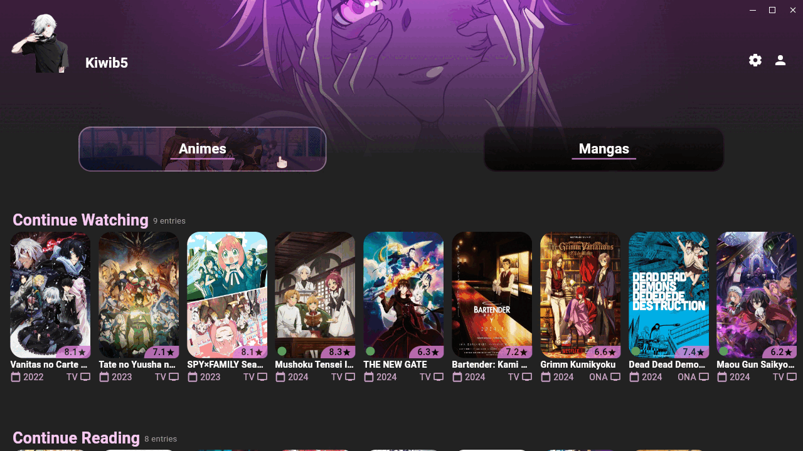

    
    <h1 align="center">Unyo</h1>

Simple and easy to use anime streaming and manga reader desktop app.

 

 
 
 
 

 
 

## About Unyo

**Unyo** is a desktop application (inspired from [Dantotsu](https://github.com/rebelonion/dantotsu)) where you can watch and read your favourite animes and mangas, it is fully integrated with anilist so whatever content you consume will always be synced automatically. It has great UI and animations, and above all Add-Free.

## Installation

You can download the latest version from the [releases](https://github.com/K3vinb5/Unyo/releases/latest) tab.

If you are on **Windows**, you can:
- Download the .zip, extract it and run the executable "unyo.exe"

If you are on **Mac**, you can:
- Download the .dmg, and install it just like any other mac application.
- Download the .zip, extract it and run the .app (Not recommended, use the dmg)

If you are on **Linux**, you can:
- Install the app using the [AM package manager](https://github.com/ivan-hc/AM) by running "am -i unyo", you can also update it from here by running "am -u unyo" (Recommended option)
- Download the .zip, extract it and run the executable "unyo"
- Downlaod the .AppImage, and run it
- Download the .deb, and install the package by running "sudo apt install ./package_name.deb" (Debian based distros only)

It is important when setting up Unyo that your Anilist profile is set to either public or semi-public. Currently Unyo won't be able to pull your anime and manga lists, if you have your account set to private.

## Available Sources

### Remote sources

The remote sources for this app are from a custom made api that uses [Aniyomi](https://github.com/aniyomiorg/aniyomi) extensions, this means that if you wish to have a source added you can open a issue saying the name of the extension and I'll try to integrate it. Note that because the orinal project was for android I had to translate a lot of the codebase to work on pc, this means that not all extensions will be working (most likely a skill issue to be honest -_-)

**English**

- Gogogoanime ✅
- Animepahe ❌
- AllAnime ✅
- AnimeParadise (No subtitles) ✅
- NollyVerse ✅ (Low on content)

**Portuguese**

- Animes CX ✅ (Low on content)
- Animes Digital ✅

**Spanish**

- AnimeYT ✅
- AnimeMovil ✅
- AnimeFenix ✅

**Italian**

- AnimesSaturn ✅

**All (Multiple subtitles and/or audios)**

- KickAssAnime ✅

### Local Sources

The local sources are basically the same as remote sources but the api runs on your computer and it uses a modular system, the extensions are based of [Aniyomi](https://github.com/aniyomiorg/aniyomi) extensions, You can download them from the app itself (if you wish to use local extensions obviosly) from my extensions repository [Unyo-Extensions](https://github.com/K3vinb5/Unyo-Extensions), later I will post some guides and tools to encourage others to contribute with extensions. Here are some advantages and disadvantages of using local extensions so you can decide for yourself if it is worth it:

#### Advantages
- Faster response times
- More extensions, since A lot of them work locally and not on the server because of the server's location
- You don't depend on the server
#### Disadvantages
- You need java 17 or later installed one your machine
- The app will consume more ram (around 100 to 200mb)

#### Local Sources dependencies
You need java 17 or later installed on your machine to run the local extensions, I imagine most people have it, but if you don't here is the download links:
- Linux: [https://www.oracle.com/java/technologies/downloads/#jdk17-linux](https://www.oracle.com/java/technologies/downloads/#jdk17-linux)
- Macos: [https://www.oracle.com/java/technologies/downloads/#jdk17-mac](https://www.oracle.com/java/technologies/downloads/#jdk17-mac)
- Windows: [https://www.oracle.com/java/technologies/downloads/#jdk17-windows](https://www.oracle.com/java/technologies/downloads/#jdk17-windows)
  
## Known Issues

- Sometimes having the opensubtitles.org subtitles active may cause the extension not to retrieve anything, if that happens please turn it off, should be fixed in the next versions
## Contributors

Contributions are always welcome! If you have any ideas or changes that you want to see in the app, submit a pull request. If you have suggestions or issues, feel free to open a issue!

Because this has happened before, I will explicitly write it, Contributing to the project means doing a pull request, opening an issue with suggestions etc. not proposing a big project which essentially is rebranding my app on another repo under your name :D.

## License

This project is licensed under the **GNU Public License version 3.0**.

## Disclaimer

- By using this app, you agree that the developer(s) of Unyo is not responsible for any content within the app and won't be legally responsible for any violations.
- All the contents in Unyo are hosted by 3rd parties, and the developer(s) is not accountable for their nature or legality. Users are advised to use the application responsibly and in compliance with relevant laws and regulations.
- Unyo or its developer(s) are not responsible for the misuse of any content within or outside the app and shall not be responsible for dissemination of any content within the app.
