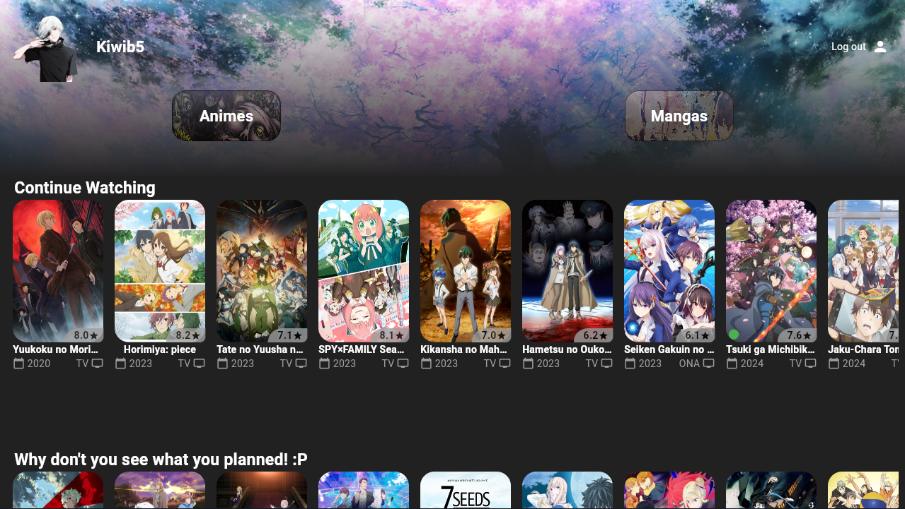
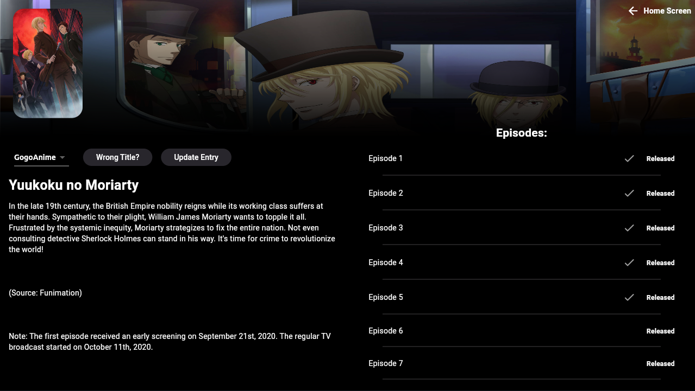
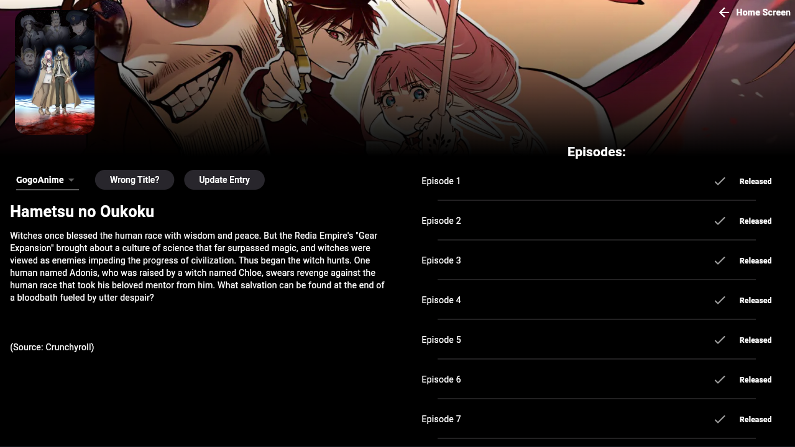
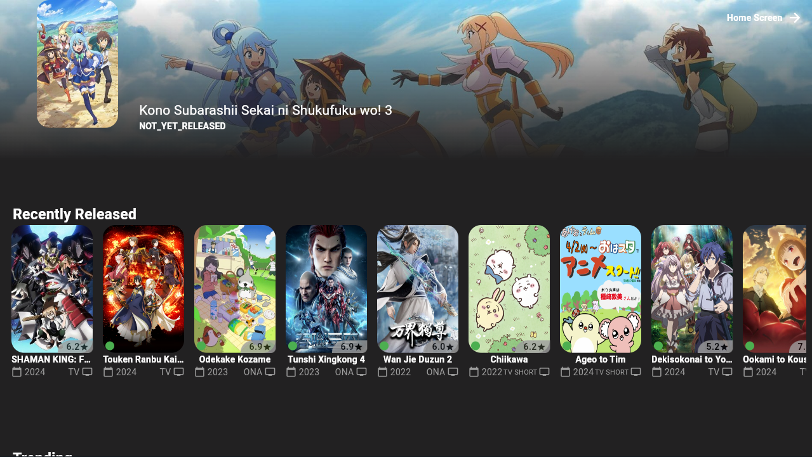
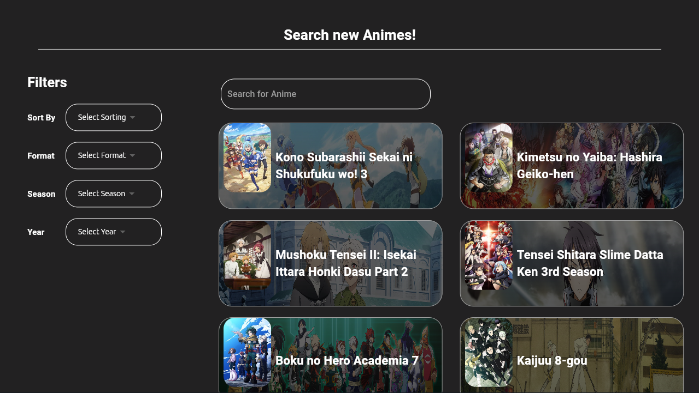

# FlutterNime

An open-source desktop app (mobile may be coming later) with integrated [anilist](https://anilist.co) support, where you can track your progress and watch your favorites shows.

## Fast Demonstration

<video controls src="readme-assets/Peek 2024-04-02 22-05.mp4" title="Title"></video>

## Features

### Home Page
You can see your home page where your main lists will be located, it is customizable through anilist avatar and banner.

### Title Details Page
Here is where you'll be able to see all the details of your favourite shows, update your progress and most importantly actually watch the show!
The show is available through multiple sources (gogoanime, zoro and animepahe)

### Anime Page

In this screen you'll be able to seee multiple custom useful lists and search your anime using the anilist api

